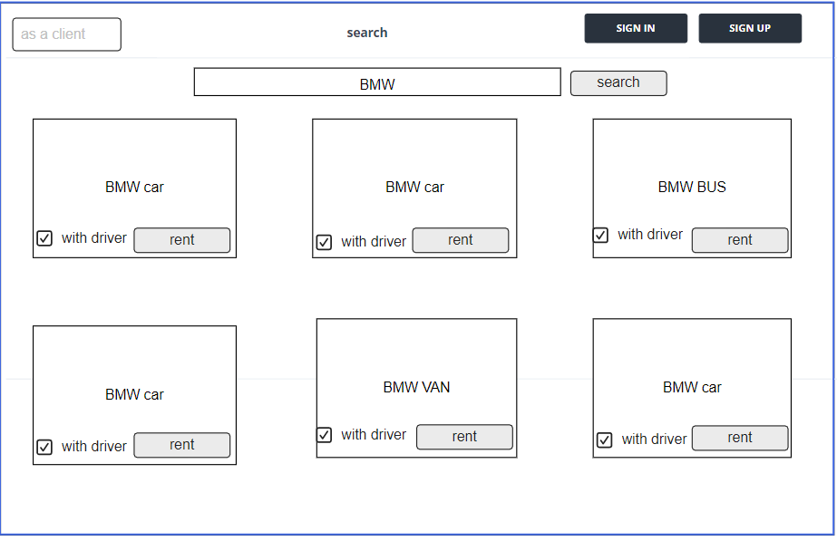
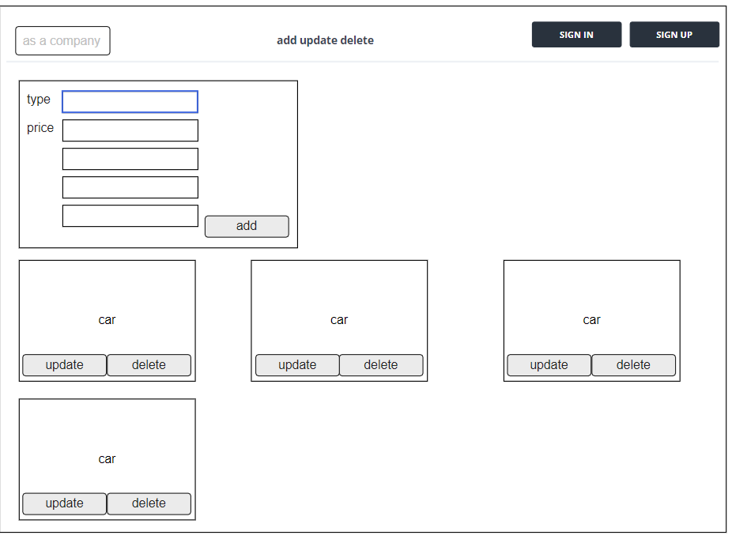
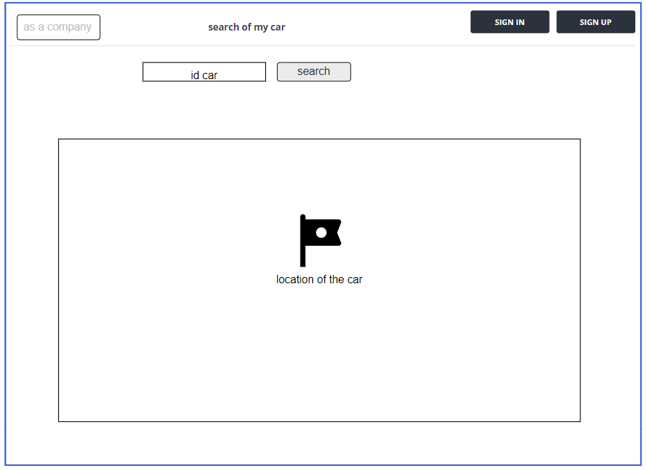
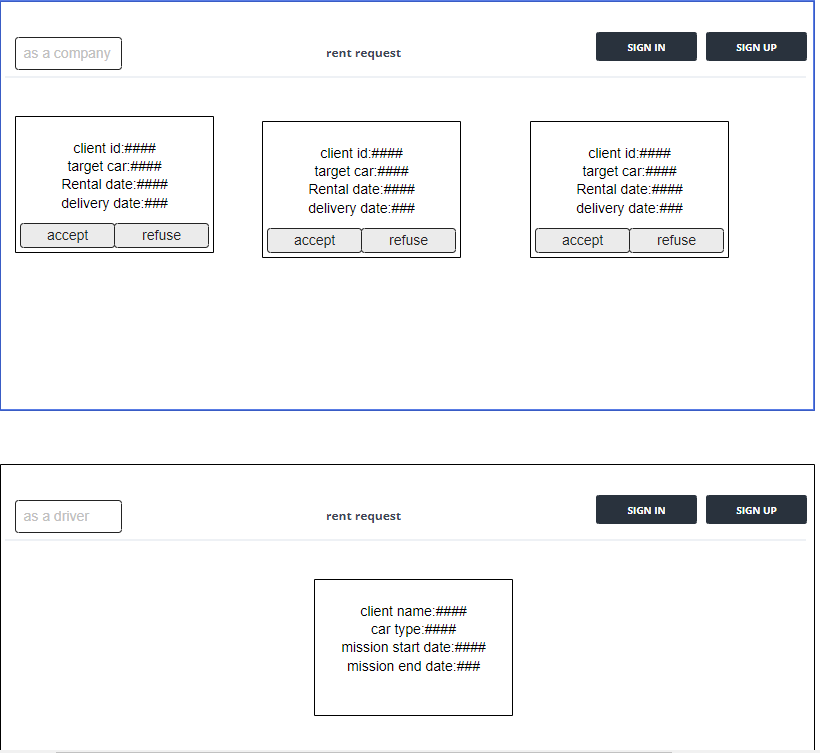
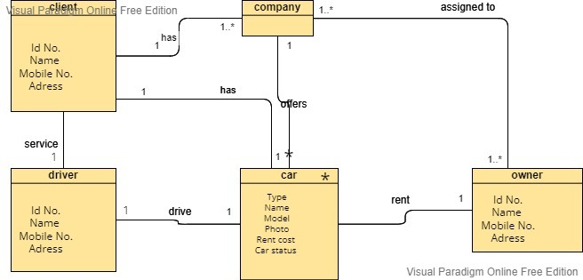

# story
## As a client, I want to view all the available cars, so that I can choose a car.
### Feature Tasks:
- the client can search about any kind of cars 
### Acceptance Tests:
- test Ensure that the cars data successfully retrieved from the database
- Provide an error message and provide a message if there is no car for rent

## As a client, I want to have the ability to rent a car, so that the company can contact me.
### Feature Tasks:
- the client can rent a car that he view  
### Acceptance Tests:
- Ensure that the statuse car that he chose changed to be not avaliable in the database.
- Provide an error message if the company dosent receive a notification 

## As a company, I want the client to notify me if he wants to rent a car so that I can know there is a probable client. 
### Feature Tasks:
- when the client  rent a car the owener company of the car will notify  
### Acceptance Tests:
- ensure that the company was notified when the client rent one of their cars .
- Provide an error message if the company dosent receive a notification .
## As a driver, I want the company to inform me if there is a delivery mission so that, I can know when I should start my trip 
### Feature Tasks:
- when the client  rent a car the driver will recieve a notification .  
### Acceptance Tests:
- ensure that the driver was notified when the client rent one of their cars .
- Provide an error message if the driver dosent receive a notification .
## As a company, I want to have the ability to add or update my cars so that the client can view my deals rental cars. 
## Feature Tasks:
- company can add a new car for rent
- company can update their car 
- Save changes
## Acceptance Tests
- Ensure that the company can add delete update their cars not the other companies cars in the database .
- Provide an error message if thers is error in adding ,updating ,deleting 

## What is the vision of this product?
- The person who rents a car  will not pay more than the real cost .
- Car owners will not be afraid for their cars.
## What pain point does this project solve?
- our web application will present to the client the best deal and for the company, our web application will allow you to track your rental cars. 
- our application will provide the one who havnt the ability to drive with a proficinal driver.
## Why should we care about your product?
- our web application will Create a competition between companies which is on the client-side to get the lowest price and the best quality.
- our web application will keep tracking the company's car's location.

# Scope :
## IN - What Our Product Does

### ***Feature 1: The owner of the car***

If you have a suitable car for rent and want to rental it, you can go to our website and in the rental section of the owner, you will find the car rental service. You can read about the requirements for the service itself, then you will fill out a form with specific information and we will offer to rent it with the information you provided

### ***The second feature: the client***

If you are a tourist or even a resident and need to rent a car, you can enter our site, and in the customer service section you will find a group of cars and information for renting this car, then you can choose the car and order it
, you can read about the requirements for the service itself.

### ***The third feature: the driver***
If you have a driver’s license and do not own a car and want to work for us, you can enter our website, and in the drivers services section, a request will come to you with the information you need about the customer and the car you will be driving, and therefore you will be able to approve the request and start work

## OUT - What Does Our Product not Do?

It will not contain a method of insurance for cars from damage or theft because we decided that it is the target of STRECH because we can not yet deal with the official laws

## Minimum applicable product

It can locate the vehicle, and you can provide your feedback about the services in the feedback page

## Stretch 
The method of car insurance against damage or theft by means of promissory notes or adding a refundable insurance amount in the event that the car is returned free of any defects

## Non-Functional Requirements

1.Security: Our website assures that all data inside the DB will be protected against malware attacks or unauthorized access.
The owners data will be protected from unauthorized access, and thats will be by  define the login flow and different user roles as system behavior or user actions.
and their passowrd will protect by hashed them before store it in the db so the encrypt will be unreversable 

2.Usability: our website has a perfect interface so the users can easily navigate its which makes them to complete the main actions once they see it, and thats Leading to reach their goals quickly 

